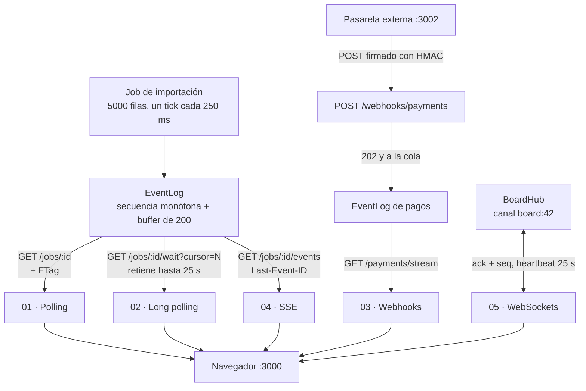

# Seminario 2026 — Semana 10

Cinco mecanismos de transporte en tiempo real —polling, long polling, webhooks,
Server-Sent Events y WebSockets— implementados en TypeScript sobre Hono.js y
Next.js, cada uno con su propia página y con el costo medido en pantalla.

Las semanas 2 a 9 movieron datos que el usuario pedía: un formulario, una
consulta, una subida. Aquí el dato cambia **en el servidor**, mientras la pestaña
sigue abierta y nadie hace clic. Request/response resuelve la lectura puntual; no
resuelve el estado que se mueve solo. Toda la semana gira sobre una sola
pregunta: **¿quién empuja el dato y cada cuánto?**

## Los cinco mecanismos

| Mecanismo | Dirección | Latencia | Costo por cliente | Usar cuando |
| --- | --- | --- | --- | --- |
| Polling | Cliente pregunta | Medio intervalo | Bajo, pero repetido | Segundos de retraso son aceptables |
| Long polling | Cliente espera | Casi inmediata | Una petición retenida | Fallback donde SSE no pasa |
| Webhooks | Servidor → servidor | Del proveedor | Nulo en el cliente | El evento nace en un tercero |
| SSE | Servidor → cliente | Inmediata | Un stream HTTP | Progreso, feeds, notificaciones |
| WebSockets | Bidireccional | Inmediata, simétrica | Un socket con estado | El cliente también escribe seguido |

La tabla se discute; los números se miden. Estas cifras salen de correr las
páginas de este repo contra el mismo job de 5000 filas (~12.5 s):

| | Polling (3 s) | Long polling | SSE |
| --- | --- | --- | --- |
| Peticiones | 10 | 51 | 1 conexión |
| Eventos vistos | 6 de 51 | 51 de 51 | 51 de 51 |
| Bytes recibidos | 585 B | 4.7 kB | 4.4 kB |
| Retraso observado | **2481 ms** | 250 ms | **1 ms** |

Polling es 8× más barato en bytes y pierde 45 de los 51 estados intermedios.
Esa es la negociación, y es legítima: si al usuario le da igual, polling gana.

## Qué construimos

| Pieza | Qué hace |
| --- | --- |
| `apps/api` | Nuestra API en Hono: expone los cinco mecanismos sobre un mismo job de importación |
| `apps/gateway` | Una pasarela de pago **externa**: firma un evento y hace POST a nuestra API |
| `apps/webapp` | Next.js con una página por mecanismo y un panel de costo compartido |
| `packages/typescript-config` | La configuración de TypeScript compartida (idéntica a la de semana 3) |

## Cómo funciona



Lo no obvio está en el centro: **`EventLog` es una sola clase**. El `?cursor=` del
long polling, el `Last-Event-ID` de SSE y el `hello { lastSeq }` del WebSocket
preguntan exactamente lo mismo —«¿qué me perdí después del evento N?»— así que se
resuelven con la misma secuencia numerada y el mismo buffer. Los tres mecanismos
que parecen distintos comparten el 80% de su implementación.

## Stack

| Pieza | Elección | Por qué |
| --- | --- | --- |
| Servidor | `hono@^4.12.7` | Router mínimo sobre Web Standards: `streamSSE` y el upgrade a WS vienen en la caja |
| Runtime | `@hono/node-server@^1.19.11` | El mismo `serve()` de las semanas anteriores |
| WebSocket | `@hono/node-ws@^1.3.1` | `injectWebSocket(server)` sobre el servidor HTTP real de Node |
| Validación | `zod@^4.4.3` | Un WebSocket no pasa por middleware: cada mensaje se valida a mano |
| Cliente | `next@^16.2.10`, `react@^19.2.7` | App Router, igual que semana 3 |
| Estilos | `tailwindcss@^4.2.2` | Solo vía `@tailwindcss/postcss`, sin `tailwind.config` |
| Monorepo | `turbo@^2.10.5`, `pnpm@10.33.0` | Tres apps que se levantan con un comando |

Sin TanStack Query a propósito: aquí el punto es *cuándo* se pide el dato, así que
polling y long polling son un `setInterval` y un `while` escritos a mano, tal como
aparecen en las láminas.

## Estructura del proyecto

```
week-10/
├── apps/
│   ├── api/src/
│   │   ├── index.ts               # las cinco rutas, en el orden de la charla
│   │   ├── event-log.ts           # la pieza reutilizada por long polling, SSE y WS
│   │   ├── jobs.ts                # la importación de 5000 filas
│   │   ├── board-hub.ts           # canales, presencia y heartbeat del WebSocket
│   │   ├── webhook-signature.ts   # HMAC + ventana de tolerancia
│   │   └── schemas.ts             # zod para el webhook y para cada mensaje del socket
│   ├── gateway/src/
│   │   ├── index.ts               # POST /charge → firma y entrega a nuestra API
│   │   └── sign.ts                # copia propia del firmado, a propósito
│   └── webapp/
│       ├── app/                   # una página por mecanismo + la tabla comparativa
│       └── lib/
│           ├── api.ts             # fetchers tipados, API_URL y GATEWAY_URL
│           ├── use-transport-stats.ts   # el panel de costo compartido
│           └── use-reconnect.ts   # backoff exponencial con jitter y techo
└── packages/typescript-config/    # @repo/typescript-config
```

## Empezar

**1. Instalar.**

```bash
cd week-10
pnpm install
```

**2. Levantar las tres apps.**

```bash
pnpm dev
```

- Webapp: http://localhost:3000
- API: http://localhost:3001
- Pasarela externa: http://localhost:3002

> **Para la demo, levanta la API en su propia terminal.** `turbo run dev` tumba
> todas las tareas cuando una muere, así que apagar la API con `Ctrl-C` se lleva
> también el webapp y no se ve la reconexión. Usa
> `pnpm --filter @app/api dev` en una terminal aparte y `pnpm --filter @app/webapp dev`
> en otra.

No hace falta ningún `.env`: los tres puertos y el secreto del webhook traen valor
por defecto. Si quieres cambiarlos, `apps/webapp/.env.local` acepta
`NEXT_PUBLIC_API_URL` y `NEXT_PUBLIC_GATEWAY_URL`.

## Comandos

```bash
pnpm dev                                  # las tres apps
pnpm build                                # compila las tres
pnpm check-types                          # tsc --noEmit en todo el workspace

pnpm --filter @app/api dev                # solo la API, para poder apagarla en la demo
pnpm --filter @app/api dev:slow-job       # un tick cada segundo: el job dura 50 s
pnpm --filter @app/webapp dev             # solo el webapp

# La pasarela externa desde la terminal
curl -XPOST localhost:3002/charge                   # una entrega, firma válida
curl -XPOST "localhost:3002/charge?duplicate=2"     # el mismo id dos veces
curl -XPOST "localhost:3002/charge?tamper=1"        # firma rota → 401

# La API a pelo
JOB=$(curl -s -XPOST localhost:3001/jobs | jq -r .jobId)
curl -s localhost:3001/jobs/$JOB                        # snapshot (polling)
curl -s -i "localhost:3001/jobs/$JOB/wait?cursor=0"     # retenida (long polling)
curl -N -H "Last-Event-ID: 3" localhost:3001/jobs/$JOB/events   # replay + vivo (SSE)
```

### Variables de entorno de la API

| Variable | Defecto | Efecto |
| --- | --- | --- |
| `JOB_TICK_MS` | `250` | Milisegundos entre lotes de 100 filas |
| `LONG_POLL_TIMEOUT_MS` | `25000` | Cuánto retiene el servidor antes de devolver 204 |
| `WEBHOOK_SECRET` | `whsec_seminario_2026` | Debe coincidir en la API y en la pasarela |

## Guion de la demostración

### Parte A · SSE (15 min)

1. Abre `/polling`, pon el intervalo en 3 s y arranca la importación. Al terminar,
   lee el panel: **10 peticiones, 4 de ellas 304**, y un retraso de ~2.5 s.
2. Abre `/sse` y arranca otra importación. **1 conexión, 51 eventos, 1 ms.**
   En la pestaña Red hay una sola petición que no termina nunca.
3. A la mitad del stream, apaga la API. El estado pasa a «conectando».
4. Vuelve a levantarla. El contador de reconexiones sube y la barra sigue desde
   donde iba: el navegador reenvió `Last-Event-ID` él solo. Nadie escribió esa
   lógica.

### Parte B · WebSocket (15 min)

1. Abre `/websockets` en dos ventanas, una al lado de la otra. Arriba se ve
   `conectados: 2`.
2. Arrastra una tarjeta en la primera: se mueve en la segunda, y en la primera
   aparece `último ack: seq N (mi envío N)`. El servidor reparte al resto del
   canal, nunca al emisor; quien manda pinta en local y espera el ack.
3. Apaga la API. El log en pantalla muestra el backoff:
   `549 ms · 1879 ms · 2527 ms · 5758 ms · 15393 ms`. Ninguno es un número
   redondo, y ahí está el punto.
4. Vuelve a levantarla: el cliente manda `hello { lastSeq }` y recibe solo el
   diferencial. Los `seq` que ya había aplicado los descarta.

## Las tres cosas que de verdad cuestan

### 1. La reconexión, y sobre todo el jitter

`1s, 2s, 4s, 8s…` con techo de 30 s es la mitad fácil. La otra mitad es el jitter:
sin él, los mil clientes que se cayeron por el mismo corte vuelven todos en el
mismo milisegundo y tiran el servidor justo cuando acaba de levantarse. En
`lib/use-reconnect.ts` el retraso es un punto al azar dentro de la ventana, no la
ventana entera.

Con SSE esto no se escribe: `EventSource` ya lo trae, y el servidor solo sugiere
el intervalo con una línea `retry: 3000`. Es la diferencia más honesta entre los
dos mecanismos.

### 2. El orden y los duplicados

Todo evento va numerado, y el cliente descarta lo que ya vio
(`if (move.seq <= lastSeq) return`). Eso es lo que permite que el catch-up de la
reconexión sea seguro: si el buffer reenvía tres eventos y dos ya se aplicaron,
no pasa nada.

Del lado del webhook es el mismo principio con otro nombre: **el reintento es la
norma**, así que `POST /webhooks/payments` deduplica por `id` del evento y
responde `202` igual. La segunda entrega recibe `202 duplicate: true` y no produce
ninguna fila nueva.

### 3. Los canales

La suscripción es por recurso (`board:42`), no una difusión global. Si todos los
clientes reciben todo y filtran en el navegador, eso es fuga de datos y ancho de
banda desperdiciado. Y la autorización del canal es la misma que la de un `GET`
del recurso: si no puedes leer el board, no puedes suscribirte a él.

Con más de una instancia del servidor haría falta un adaptador con Redis: el hub
de `board-hub.ts` vive en memoria y solo conoce los sockets de su propio proceso.

## Laboratorio

Elige **un** mecanismo y justifícalo, no lo adivines:

1. Toma una pantalla real de tu proyecto donde el dato cambie solo.
2. Responde las tres preguntas de la portada: ¿el cliente escribe seguido?
   ¿cuánto retraso tolera el usuario? ¿qué pasa si se desconecta 30 s?
3. Implementa el mecanismo que salga de ahí sobre `apps/api`, con su página en
   `apps/webapp`.
4. Entrega el panel de costo con números reales y un párrafo defendiendo la
   elección con latencia, costo y tolerancia a fallos.

Una respuesta de «polling cada 5 s» bien defendida vale lo mismo que un WebSocket.
Lo que no vale es abrir un socket sin haber contestado la pregunta 3.

## Notas

- **Sobre Nest.js.** Las láminas muestran los dos frameworks. En Nest el mismo
  stream es `@Sse(':id/events')` devolviendo un `Observable<MessageEvent>`, y el
  canal bidireccional es `@WebSocketGateway({ namespace: '/board' })` con
  `@SubscribeMessage`. Cambia la ergonomía, no el mecanismo: sigue siendo
  `text/event-stream` y sigue siendo un upgrade HTTP. Aquí usamos solo Hono.
- **Sobre Bun.** En Bun el WebSocket se monta con
  `createBunWebSocket()` de `hono/bun` y se exporta
  `{ fetch: app.fetch, websocket }`. Con Node hace falta
  `createNodeWebSocket({ app })` y llamar a `injectWebSocket(server)` después de
  `serve()`, porque el upgrade necesita el servidor HTTP real y no solo
  `app.fetch`.
- **CORS y el polling condicional.** `If-None-Match` no está en la lista blanca
  del navegador y `ETag` no se expone por defecto. Sin declarar los dos en la
  configuración de CORS, el 304 nunca llega a ocurrir desde el navegador y el
  demo de polling parece más barato de lo que es. Están declarados en
  `apps/api/src/index.ts`, junto con `maxAge` para que el preflight no duplique
  cada petición.
- **El estado vive en memoria.** Jobs, pagos y pizarra se pierden al reiniciar la
  API, y el buffer de eventos tiene techo de 200. Es deliberado: la semana es
  sobre transporte, no sobre persistencia.
- **La pasarela duplica el código de firma.** No es un descuido. Un proveedor
  externo es otra empresa: no importa nuestros módulos. Lo único que comparten
  los dos lados es el secreto y el formato de la cabecera.
