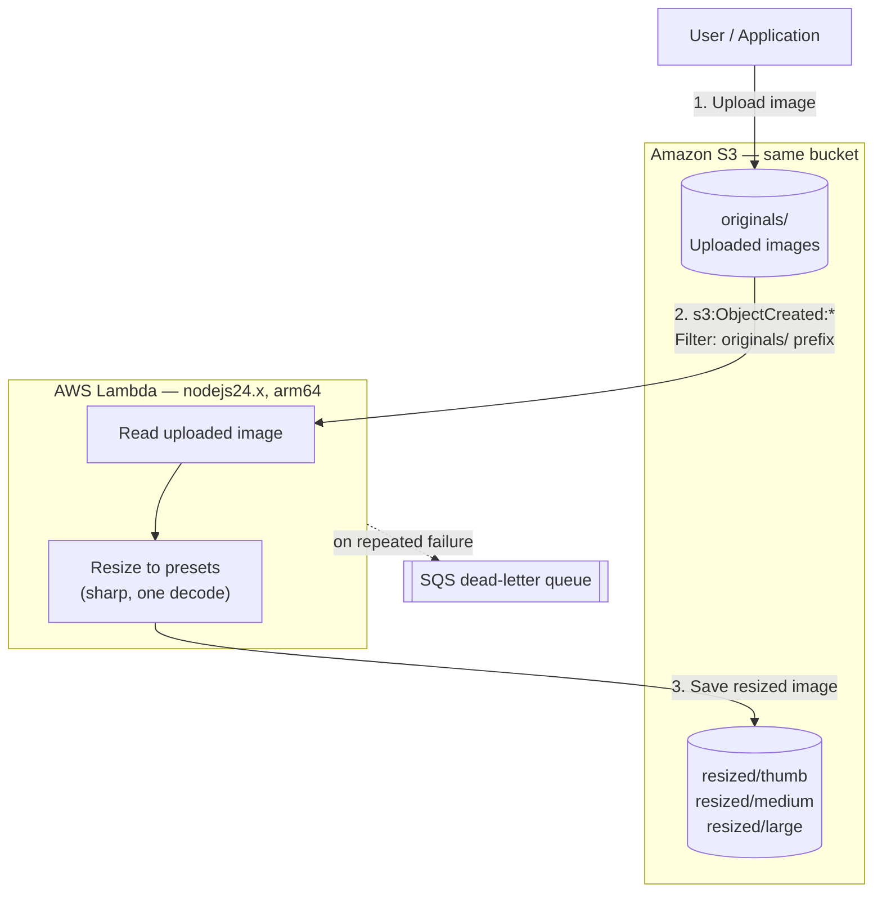

# Seminario 2026 — Week 9

Event-driven image resizing on AWS: upload to `originals/`, get WebP derivatives
in `resized/` — same bucket, no server, no queue to poll.

This is the first week that deploys to a real cloud. Weeks 2–8 ran locally on
Docker Compose; here the runtime is AWS Lambda and the infrastructure is
declared with Pulumi in the same language as the handler.

## What we built

| Piece | What it does |
| --- | --- |
| S3 bucket | One bucket, two prefixes: `originals/` in, `resized/` out |
| S3 event notification | `s3:ObjectCreated:*` filtered to the `originals/` prefix |
| Lambda function | Reads the original, resizes to three presets, writes WebP back |
| SQS dead-letter queue | Catches invocations that fail all retries |
| CloudWatch log group | Explicit, JSON-formatted, 14-day retention |
| Pulumi program | The four resources above, in TypeScript, one `pulumi up` |

## How it works



The interesting part is the arrow that **isn't** there: `resized/` does not
trigger the Lambda. See [Recursion](#the-recursion-trap) below.

## Stack

| Piece | Choice | Why |
| --- | --- | --- |
| IaC | Pulumi `^3.261` + `@pulumi/aws` `^7.44` | Real TypeScript, not a DSL — the handler and the infra share types |
| Runtime | `nodejs24.x` on `arm64` | Latest **GA** Lambda runtime. `nodejs26.x` exists but is public preview: no SLA, breaking changes allowed |
| Resize | `sharp` `^0.35.4` | libvips-backed; several times faster and far lower peak memory than ImageMagick bindings |
| Output | WebP, quality 80 | ~30% smaller than equivalent JPEG, universally supported |
| Bundler | `esbuild` `^0.28` | One `index.mjs`; `sharp` stays external because it loads a native binary |
| Validation | `zod` `^4` | Same as week-8 — parses both Pulumi config and Lambda env |
| Tests | `vitest` `^5` | Covers the pure logic; no AWS account needed |

## Project layout

```
week-9/
├── Pulumi.yaml               # runtime: nodejs, loaded through tsx
├── Pulumi.dev.yaml           # region, presets, quality — per-stack config
├── src/                      # infrastructure (the Pulumi program)
│   ├── index.ts              # wires everything, exports stack outputs
│   ├── config.ts             # pulumi.Config -> typed, zod-validated settings
│   ├── bucket.ts             # bucket + access block + encryption + lifecycle
│   ├── lambda.ts             # role, least-privilege policy, log group, fn, DLQ
│   └── notification.ts       # lambda.Permission + s3.BucketNotification
├── lambda/                   # function code (bundled, never run by Pulumi)
│   ├── handler.ts            # S3Event -> get, resize, put
│   ├── resize.ts             # pure: Buffer -> Derivative[]
│   ├── keys.ts               # pure: source key -> output keys
│   ├── env.ts                # zod-parsed process.env
│   └── *.test.ts             # runs locally on the darwin sharp binary
├── scripts/
│   ├── build-lambda.ts       # esbuild + staged linux/arm64 install + assertions
│   ├── upload.ts             # demo: put a file in originals/
│   ├── inspect.ts            # demo: list resized/ with sizes and dimensions
│   └── stack.ts              # shared: read `pulumi stack output --json`
└── build/lambda/             # generated deployment package (gitignored)
```

## Getting started

Prerequisites: Node 24, pnpm, the Pulumi CLI, and AWS credentials.

```bash
pnpm install
```

**1. Pick a state backend.** Pulumi needs somewhere to store stack state. Check
whether you already have one:

```bash
pulumi whoami          # prints your Pulumi Cloud account, or errors if logged out
```

If you are logged out, the local filesystem is enough for a classroom demo and
needs no account:

```bash
pulumi login --local
```

**2. Confirm which AWS account you are about to spend money in.**

```bash
aws sts get-caller-identity --profile personal
```

If your credentials live under a named profile (as above), set it once in the
stack config so both Pulumi and the demo scripts agree:

```bash
pulumi config set aws:profile personal
```

`Pulumi.dev.yaml` already has `aws:profile: personal`. The demo scripts read
that same value via `pulumi config get aws:profile`, so there is one source of
truth — change it there and everything follows. An `AWS_PROFILE` environment
variable still wins if you set one.

**3. Create the stack.** The config in `Pulumi.dev.yaml` is already committed,
so a stack named `dev` picks it up automatically.

```bash
pulumi stack init dev
```

**4. Build and preview.** `preview` runs the packaging step first, because
Pulumi hashes `build/lambda/` to decide whether the function changed.

```bash
pnpm preview
```

**5. Deploy.**

```bash
pnpm deploy:up
```

**6. Run the demo.**

```bash
pnpm demo:upload    # puts assets/sample.jpg in originals/
pnpm demo:inspect   # polls resized/ and prints what landed
```

Expect three objects — `resized/thumb/sample.webp`, `resized/medium/sample.webp`,
`resized/large/sample.webp` — within a few seconds.

**7. Watch it happen.**

```bash
aws logs tail "$(pulumi stack output logGroupName)" --follow
```

**8. Tear it down.** The bucket is created with `forceDestroy: true`, so this
deletes the images too.

```bash
pnpm deploy:down
```

## Commands

```bash
pnpm build:lambda    # esbuild the handler + stage linux/arm64 sharp, with assertions
pnpm preview         # build, then pulumi preview
pnpm deploy:up       # build, then pulumi up
pnpm deploy:down     # pulumi destroy
pnpm demo:upload     # upload assets/sample.jpg (or: pnpm demo:upload path/to/img.jpg)
pnpm demo:inspect    # list derivatives with size + dimensions
pnpm test            # vitest, no AWS needed
pnpm check-types     # tsc --noEmit

pnpm tsx scripts/make-sample.ts   # regenerate assets/sample.jpg
```

## The three things that are actually hard

### The recursion trap

The Lambda writes to the same bucket that triggers it. Wire the notification
without a filter and every write triggers another invocation, which writes
again — an unbounded loop that bills by the invocation. Two guards:

1. **`filterPrefix: "originals/"`** on the notification. This is the real fix;
   S3 never delivers an event for anything under `resized/`.
2. **`isEligible()`** in `lambda/keys.ts`, which re-checks the prefix and skips
   folder markers. Redundant on purpose — the notification config is one
   careless edit away from being wrong, and this is the cheap seatbelt.

To confirm it holds, upload once and check that the object count under
`resized/` stays at exactly 3 and the function's invocation count stays at 1.

### Native binaries in a pnpm deployment package

`sharp` is not pure JavaScript — it loads a prebuilt libvips binary matched to
platform and architecture. Two independent ways this breaks:

- **Wrong architecture.** `pnpm install` on an Apple Silicon Mac fetches
  `@img/sharp-darwin-arm64`. Zip that and Lambda dies with
  `Cannot find module '../build/Release/sharp-linux-arm64.node'`.
- **Symlinks.** pnpm's default `node_modules` is a tree of symlinks into a
  content-addressed store. **AWS does not support symlinks inside a deployment
  package**, so the zip arrives with dangling links.

`scripts/build-lambda.ts` handles both by installing into a *separate staging
directory* with its own generated `package.json`:

```jsonc
{
  "dependencies": { "sharp": "0.35.4" },
  "pnpm": {
    "supportedArchitectures": { "os": ["linux"], "cpu": ["arm64"], "libc": ["glibc"] }
  }
}
```

```bash
pnpm install --dir build/lambda --node-linker=hoisted --ignore-workspace --prod
```

- `supportedArchitectures` → fetches the linux/arm64 prebuild instead of darwin.
- `--node-linker=hoisted` → a real directory tree, no symlinks.
- `--ignore-workspace` → keeps this install isolated, so week-9's own
  `node_modules` keeps the **darwin** binary and `pnpm test` still runs locally.

That gets most of the way, but two things still leak through and the build
script cleans them up — both found by the assertions, not by reading docs:

- **`node_modules/.bin` is still symlinked** even under `--node-linker=hoisted`.
  Those shims exist to run CLIs from a terminal; the Lambda runtime never looks
  at them, so the script deletes every `.bin` directory.
- **pnpm honors `os` and `cpu` but ignores `libc`.** Ask for `glibc` and you
  still get `@img/sharp-linuxmusl-arm64` and `@img/sharp-libvips-linuxmusl-arm64`
  — 18 MB of Alpine binaries that Amazon Linux 2023 can never load. The script
  reads each `@img/*` package's own declared `libc` field and drops any that
  doesn't include `glibc`. Package: **39 MB → 20 MB, 17 MB → 8.5 MB zipped.**

The script asserts all four properties and exits non-zero if any fails, because
the alternative is finding out from a CloudWatch stack trace:

```
ok  @img/sharp-linux-arm64 present
ok  @img/sharp-darwin-arm64 absent
ok  only glibc binaries present
ok  no symlinks in the deployment package
```

> `supportedArchitectures` lives in `package.json` in pnpm 10 and moved to
> `pnpm-workspace.yaml` in pnpm 11. `packageManager` is pinned to `pnpm@10.33.0`
> so this stays unambiguous; if you bump it, the build assertions will tell you.

### Decode once, resize three times

The obvious implementation calls `sharp(buffer).resize(w).webp()` once per
preset — which decodes the source JPEG three times. `lambda/resize.ts` builds
the pipeline once and clones it:

```ts
const pipeline = sharp(input, { limitInputPixels }).rotate();
// then per preset: pipeline.clone().resize(...).webp(...)
```

Also in that file, and each there for a reason:

- **`.rotate()` with no argument** applies EXIF orientation. Omit it and photos
  from phones come out sideways — the single most common resize bug.
- **`withoutEnlargement: true`** stops a 300px original being upscaled into a
  blurry 1600px "large".
- **`limitInputPixels`** rejects decompression bombs: a small file that decodes
  to gigabytes of pixels and OOMs the function.
- **`sharp.cache(false)` and `sharp.concurrency(1)`** at module scope. libvips
  defaults are tuned for a long-lived server with many cores; in a Lambda
  sandbox they just inflate memory.

## Notes

- **`s3.Bucket`, not `s3.BucketV2`.** In AWS provider v5/v6 the guidance was to
  migrate *to* `BucketV2`. Provider v7 reversed it: `BucketV2` is now deprecated
  in favor of `Bucket`, and the companion resources dropped their `V2` suffix
  too. Most search results and blog posts still show the old advice.
- **One notification per bucket.** A bucket supports exactly one
  `aws.s3.BucketNotification` resource. A second one does not add to the first —
  it silently overwrites it and produces a perpetual diff. Multiple destinations
  must be nested blocks inside the single resource.
- **ESM + Pulumi.** Pulumi's built-in TypeScript loader is awkward with ESM, so
  `Pulumi.yaml` sets `typescript: false` and `nodeargs: "--import tsx"`. If you
  pass any of `--loader` / `--import` / `--require`, Pulumi stops configuring its
  own loader and expects yours to handle it.
- **`forceDestroy: true`** on the bucket is a classroom convenience. It lets
  `pulumi destroy` delete a bucket that still has objects in it. Do not do this
  to a bucket you care about.
- **The IAM policy is written out by hand** rather than attaching
  `AWSLambdaBasicExecutionRole`. It grants `s3:GetObject` on `originals/*` and
  `s3:PutObject` on `resized/*` — the function is *incapable* of reading its own
  output or writing over an original, which is a second structural guard against
  the recursion loop.
- **The log group is explicit.** Left alone, Lambda creates one on first
  invocation with infinite retention that Pulumi does not manage and
  `pulumi destroy` leaves behind, quietly billing forever.
- **Memory is set to 1536 MB.** Lambda scales vCPU with memory, so for a
  CPU-bound resize more memory often costs *less* per image, not more. Worth
  demonstrating: set `memorySize` to 512 in `Pulumi.dev.yaml`, redeploy, and
  compare the billed durations.
- **Named AWS profiles.** `aws:profile` in `Pulumi.dev.yaml` covers the Pulumi
  side. The demo scripts use plain AWS SDK clients, which do *not* read Pulumi
  config, so `scripts/stack.ts` resolves the profile and exports it as
  `AWS_PROFILE` before constructing any client. That is why those scripts build
  their `S3Client` inside `main()` rather than at module scope — a module-level
  client would capture credentials before the profile was applied.
- **Cost.** S3 plus a handful of Lambda invocations is cents, but the bucket
  lifecycle rule expires `originals/` after 7 days and `pnpm deploy:down` still
  matters.
